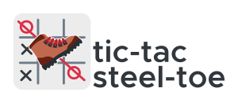

<p align="center">
    
</p>
<h3 align="center">
    Yet another reinforcement learning approach to solving tic-tac-toe
</h3>
Like steel-toe boots: they're boots, but reinforced.

This is the most straightforward, unsophisticated, software implementation of a [MENACE](https://en.wikipedia.org/wiki/Donald_Michie#Career_and_research)-like system I could come up with.


## Usage
```
usage: ttst.py [-h] [-p1 P1] [-p2 P2] [-t1 P1] [-t2 P2] [-n INT] [-q]
               [-g FILE] [-f]

Play tic-tac-toe against a reinforcement learning agent. If no brainfile is
specified for a given player, then that player is assumed to be a human.

optional arguments:
  -h, --help            show this help message and exit
  -p1 P1, --player1 P1  brainfile for the first player
  -p2 P2, --player2 P2  brainfile for the second player
  -t1 P1, --train1 P1   brainfile to train as a first player
  -t2 P2, --train2 P2   brainfile to train as a second player
  -n INT, --iterations INT
                        how many matches to play during training, default is
                        5000
  -q, --quiet           don't print while training
  -g FILE, --generate FILE
                        write an empty brainfile to FILE
  -f, --force           overwrite without asking when generating base
                        brainfiles
```

To run for the first time:
```
$ python ttst.py -g brain1.pickle
$ python ttst.py -g brain2.pickle
$ python ttst.py -t1 brain1.pickle -t2 brain2.pickle -n 10000
$ python ttst.py -p2 brain2.pickle
```
If you are winning most of the matches, try training with a higher `n`.

When you run `$ python ttst.py -t1 brain1.pickle -t2 brain2.pickle` you are training two models at the same time, brain1 will be a good first player, brain2 a good second player. A tie is considered a win for the second player.

## More examples
### Play against the computer without training it
Human goes first `$ python ttst.py -p1 brain.pickle`    
Computer goes first `$ python ttst.py -p2 brain.pickle`

### Play against a friend in your terminal
```
$ python ttst.py
```
